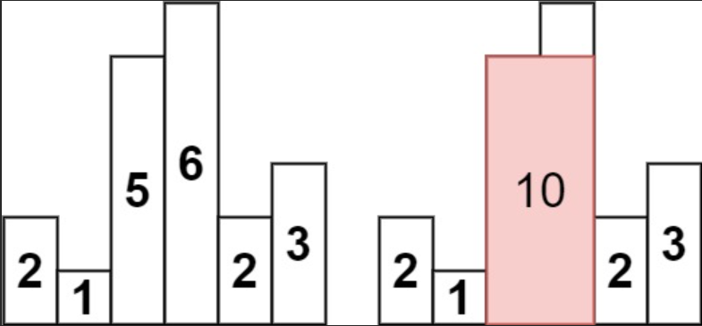

# Стек

## задача 1 

Намерете n-то числи не Фибоначи използвайки стек вместо рекурсия. 

## Задача 2
* Вход: Низ състоящ се от отварящи и затварящи скоби.
* Изход: Дали скобите в този низ са балансирани

Примери: 
* ((())) -> true
* ))()   -> false
* ()[]{} -> true

## Задача 3
Имплементирайте опашка със стек

## Задача 4
Даден е масив от височини на цели числа, представляващи височината на лентата на хистограмата, където ширината на всяка лента е 1, намерете площта на най-големия правоъгълник в хистограмата.

Вход: височини = [2,1,5,6,2,3]
Изход: 10
Обяснение: Горното е хистограма, където ширината на всяка лента е 1.
Най-големият правоъгълник е показан в червената област, чиято площ е = 10 единици.

## Бонус задачи
1. Да се сортира стек като използвате само един допълнителен стек.

2. Да се направи задачата със скобите, обаче този път функцията ни казва дали е възможно низът да стане балансиран след най - много едно изтриване на скоба.

Пример:
* )) -> false
* ()) -> true
* () -> true
* (()()()  -> true
* ())) -> false