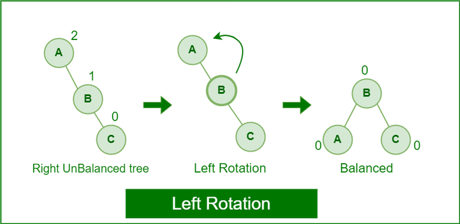
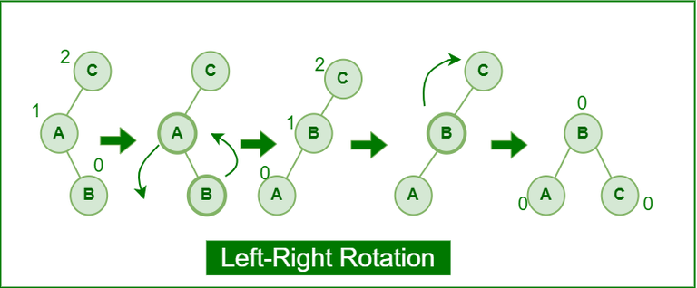
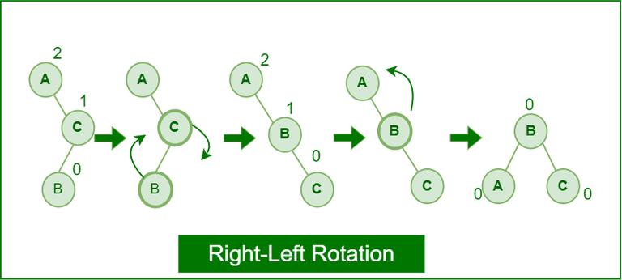

# AVL дървета.

## Целта за днес
| Операции    | build(x)       |  find(x)       |   insert/delete   | min/max       |   prev/next |
| ----------- | -----------    |-----------     |    -----------    | ----------    | ---------   |
| Binary tree | O(nlog(n))     |   O(h)         | O(h)              |  O(h)         |   O(h)      |
| AVL tree    | O(nlog(n))     |   O(log(n))    | O(log(n))         |  O(log(n))    |   O(log(n)) |

## Балансирани дървета
Двоично дърво, което поддържа log(n) височина при динамични операции се нарича **балансирано дърво**.

Има много схеми за балансиране на дървета което влезе и съществуването на различни видове балансирани дървета (Red-Black tree, 2-3 Tree...)

Първата схема за балансиране на дървета е предложена през 1962 година от Andelson-Velsky и Landis от където идва и името на AVL дървото.

```
Баланс фактор на възел k определяме като: bf(k) = h(k->right) - h(k->left). 
```

```
Целта ни е за всеки възел k bf(k) да е в множеството {-1, 0, 1}.
```

Трябва да поддържаме това свойство при всяко добавяне или премахване на възел. Тук на помощ идват ротациите! 

Тяхната реализация както и тестове за тяхната коректност можете да намерите [тук](https://github.com/stoychoX/Data-structures-and-algorithms/blob/main/Seminar09/solutions.cpp#L75).

## Как разбираме, че сме нарушили балансираността на възел?
Ако bf(k) не е в {-1, 0, 1} то тогава сме нарушили балансираността. Трябва ни начин да пресмятаме баланс фактора на всеки възел колкото се може по - бързо. Както в много неща в този курс, за да пресмятаме бързо баланс фактора на възел ще жертваме малко памет и ще записваме височината на поддървото във всеки възел. Структурата би изглеждала така:

```cpp
template<class T>
struct Node
{
	T data;
	Node* left;
	Node* right;
	int height;

	Node(const T& data, Node* left = nullptr, Node* right = nullptr, int height = 1)
		: data(data), left(left), right(right), height(height) {};

};
```
Сега, за константно време можем да смятаме баланс фактора:
```cpp
template<class T>
int AVL<T>::height(Node* root) const
{
	if (root == nullptr)
		return 0;

	int leftHeight = (root->left != nullptr) ? root->left->height : 0;
	int rightHeight = (root->right != nullptr) ? root->right->height : 0;

	return std::max(leftHeight, rightHeight) + 1;
}

template<class T>
int AVL<T>::balanceFactor(Node* root) const
{
	if (root == nullptr)
		return 0;

	int balance = height(root->left) - height(root->right);

	if (balance < -2 || balance > 2)
		throw "Invalid tree";

	return balance;
}
```
Разбира се, тази сметка е вярна тогава и само тогава когато височините на лявото и дясното поддърво са коректни.

## insert
Искаме да напишем операция, която за логаритмично време добавя елемент в дървото и запазва неговата балансираност. 

В началото започваме по стандартния начин - рекурсивно намираме къде да добавим елемента и го добавяме като листо. След това обаче става интересно - какво става ако този елемент разбалансира дървото? Той увеличава височината на (логаритмичен) брой поддървета и е напълно възможно да направи някой баланс фактор на 2 или -2. 

Използваме факта, че рекурсивно сме слезли до някое листо и когато излизаме от рекурсията чрез ротации поправяме балансираността на дървото.

При добавяне на елемент ни се налага да направим **най - много две ротации**

Алгоритъмът за добавяне би изглеждал по следния начин:

```cpp
template<class T>
class AVL<T>::Node* AVL<T>::insert(Node* root, const T& data)
{
	if (root == nullptr)
		return new Node(data);

	if (root->data < data)
	{
		root->right = insert(root->right, data);
	}

	if (root->data > data)
	{
		root->left = insert(root->left, data);
	}

	return balance(root);
}
```
Как можем да оптимизираме този алгоритъм като знаем, че винаги при вмъкване се правят най - много две ротации?

Логиката по добавянето е почти същата като при стандартното двоично наредено дърво, но този път имаме функциии поддържащи баланса на r.




```cpp
/*
A					B

	B		->	A		C

		C 
*/
template<class T>
class AVL<T>::Node* AVL<T>::LRotation(Node* root) const
{

	Node* newRoot = root->right;
	root->right = newRoot->left;
	newRoot->left = root;

	newRoot->left->height = height(newRoot->left);
	newRoot->height = height(newRoot);

	return newRoot;
}
```


```cpp
/*
		A			B

	B		->	C		A

C
*/
template<class T>
class AVL<T>::Node* AVL<T>::RRotation(Node* root) const
{
	Node* newRoot = root->left;
	root->left = newRoot->right;
	newRoot->right = root;

	newRoot->right->height = height(newRoot->right);
	newRoot->height = height(newRoot);

	return newRoot;
}
```



```cpp
/*
	C				C			B

A		->		B		->	A		C

	B		A
*/
template<class T>
class AVL<T>::Node* AVL<T>::LRRotation(Node* root) const
{
	root->left = LRotation(root->left);

	return RRotation(root);
}
```



```cpp
/*
A				A			B

	C	->	B		->	A		C

B				C
*/
template<class T>
class AVL<T>::Node* AVL<T>::RLRotation(Node* root) const
{
	root->right = RRotation(root->right);

	return LRotation(root);
}
```

```cpp
template<class T>
class AVL<T>::Node* AVL<T>::balance(Node* root) const
{
	if (root == nullptr)
		return nullptr;

	// Update height
	root->height = height(root);

	// Balance Factor and Rotation
	if (balanceFactor(root) == 2 && balanceFactor(root->left) == 1)
		return RRotation(root);

	if (balanceFactor(root) == 2 && balanceFactor(root->left) == -1)
		return LRRotation(root);

	if (balanceFactor(root) == -2 && balanceFactor(root->right) == -1)
		return LRotation(root);

	if (balanceFactor(root) == -2 && balanceFactor(root->right) == 1)
		return RLRotation(root);

	return root;
}
```

Проверката за ляв дисбаланс ще изглежда по симетричен начин.
При левия дисбаланс баланс факторът при който трябва да оправим нещата няма да е 2 а ще е -2. Също така случая, в който ни трябват две ротации няма да е -1 а ще е 1.

## Премахване на елемент
При стандартните дървета имахме следния алгоритъм:
1. Намери елемента.
2. Ако елемента е листо просто го изтрий
3. Ако елемента има само ляво или само дясно поддърво просто лявото (или дясното) поддърво заемат неговото място а той бива изтрит.
4. В противен случай намери най малкия елемент в дясното му поддърво. Този елемент става корен а ние изтриваме елемента, който ни беше зададено да изтрием.

В този алгоритъм обаче винаги се премахва едно листо. Това значи, че височината на логаритмичен брой поддървета ще се промени, а на нас това не ни харесва.  

Това което трябва да добавим в алгоритъма е балансиране на пътя, по който сме преминали. Също така трябва динамично да променяме височините така, че те да са коректни.

```cpp

template<class T>
class AVL<T>::Node* AVL<T>::remove(Node* root, const T& data)
{
	if (root == nullptr)
		return nullptr;

	if (root->data < data)
	{
		root->right = remove(root->right, data);
		return balance(root);
	}

	if (root->data > data)
	{
		root->left = remove(root->left, data);
		return balance(root);
	}

	if (root->right == nullptr)
	{
		Node* result = root->left;
		delete root;
		return balance(result);
	}

	if (root->left == nullptr)
	{
		Node* result = root->right;
		delete root;
		return balance(result);
	}

	if (height(root->left) < height(root->right))
	{
		root->data = getMin(root->right);
		root->right = remove(root->right, root->data);
	}
	else
	{
		root->data = getMax(root->left);
		root->left = remove(root->left, root->data);
	}

	return balance(root);
}
```

## Итериране 
Бихме искали да итерарираме елементите като всеки стандартен контейнер

```cpp


	Iterator find(Node* root, const T& data, std::stack<Node*>& s)
	{
		if (root == nullptr)
			return Iterator();

		if (root->data == data)
		{
			s.push(root);
			
			return Iterator(s);
		}

		if (root->data > data)
		{
			s.push(root);

			return find(root->left, data, s);
		}

		return find(root->right, data, s);
	}

	class Iterator
	{
	private:
		std::stack<Node*> s;

		bool valid() const
		{
			return !s.empty();
		}

		T next()
		{
			if (valid())
			{
				Node* top	= s.top();
				T res		= top->data;
				s.pop();
				partialInorder(top->right);

				return res;
			}

			throw "Invalid iterator";
		}

		void partialInorder(Node* root)
		{
			while (root != nullptr)
			{
				s.push(root);
				root = root->left;
			}
		}


	public:

		Iterator() = default;
		Iterator(const std::stack<Node*>& s) : s(s) {};

		Iterator(Node* root)
		{
			partialInorder(root);
		};

		T operator++()
		{
			return next();
		}

		T operator++(int)
		{
			T result = s.top()->data;
			next();
		
			return result;
		}

		T& operator*()
		{
			if (valid())
			{
				return s.top()->data;
			}

			throw "Invalid iterator";
		}

		bool operator==(const Iterator& other)
		{
			return s.top() == other.s.top();
		}

		bool operator!=(const Iterator& other)
		{
			return s.top() != other.s.top();
		}

		operator bool() const
		{
			return valid();
		}
	};
```


## Дърветата и stl
В стандартната библиотека на c++ няма нещо като std::tree\<T>. Въпреки това stl ни предоставя обекти, които в реализацията си използват балансирани дървета.

### std::set
Сет (или множество) е асоциативен контейнер който съдържа сортирана последователност от обекти от тип Т. Търсене, премахване и добавяне имат логаритмична сложност. В стл сетовете се имплементират чрез червено черни дървета, които също като AVL дървото поддържат логаритмична височина (използвайки друга схема за балансиране).

Както в множествата, обектите в сета **са уникални**. За него можете също да си мислите като за дърво, което при insert не допуска повторения на ключове.

Да видим бърз пример:
```cpp
#include<iostream>
#include<set>

int main() {
	std::set<int> s;

	for (size_t i = 0; i < 10; i++)
		s.insert(i);

	// find метода връща итератор към елемента
	std::set<int>::iterator elem = s.find(4);

	// Това извежда 4
	std::cout << *elem << " ";

	// Отиваме на следващия елемент... Но колекцията е сортирана!
	++elem;
	
	// Това извежда 5
	std::cout << *elem;
}
```

Супер, но какво връща find когато елемента го няма? Как изобщо да премахвам елемент? Следващия пример отговаря на тези въпроси.

```cpp
#include<iostream>
#include<set>

int main() {
	std::set<int> s;

	// Вкарваме 10 пъти 5, но елементите нямат повторения!
	for (size_t i = 0; i < 10; i++)
		s.insert(5);

	// Премахваме 5
	s.erase(5);

	std::set<int>::iterator it = s.find(5);

	// Когато елемента го няма в множеството просто връща end() итератора (както е с много други обекти в stl)
	if (it == s.end())
		std::cout << "Element not found!";
}
```

Та обекта го няма - връща end итератора. Лесна работа. Супер сега обаче наредбата не ми харесва. Искам колекцията ми да е сортирана в обратен ред. Сортировката зависеше единствено от компаратор функцията (rли релацията по която сортирам, която в първия пример по подразбиране е <). Дали не мога да накарам моя сет да сортира по >?
Това би станало по следния начин:

```cpp
#include<iostream>
#include<set>

int main() {
    // std::greater<T> е структура с оператор()
    // Дали ще можем ние да си напишем наша структура с operator() 
    // И да я пуснем като comparator? Опитайте!
	std::set<int, std::greater<int>> s;

	for (size_t i = 0; i < 10; i++)
		s.insert(i);

	for (auto x : s)
		std::cout << x << " ";
}
```

Често ни се налага да държим в множество обекти които не са числа а примерно някакви структури или класове. Да разгледаме следния код:

```cpp
#include<set>

struct Entity {
    int x;
    int y;
};

int main() {
    std::set<Entity> s;

    s.insert({1, 1});
}
```
Тази програма ще ни върне грешка. Все пак std::set държи последователността сортирана. Тук по какво да сортира? Компилатора ни се оплаква, че нямаме operator<. Нека си напишем и да видим какво ще се случи:

```cpp
#include<set>

struct Entity {
    int x;
    int y;

    bool operator<(const Entity& e) const {
        return x < e.x;
    }
};

int main() {
    std::set<Entity> s;

    s.insert({1, 1});
}
```
Сега вече всичко работи. Ами ако ни трябват повторения?

## std::multiset
std::multiset е мултимножество. Освен стандартните функции multiset може да ни каже колко обекта от този тип имаме чрез метода count. Тук метода erase премахва **всички** елементи с подадена стойност! Ако искаме да премахнем един елемент използваме метода extract. extract връща елемент от тип node handle който държи в себе си стойността на извадения елемент.

```cpp
#include<set>
#include<iostream>

int main() {
	std::multiset<int> s;
	s.insert(10);
	s.insert(10);
	s.insert(10);
	auto k = s.extract(10);

    // 10 2
	std::cout << k.value() << " " << s.count(10);
}
```

## std::map
std::map е сортиран контейнер, който реализира Key-Value двойки. Какво ще рече това? Примерно, даден ми е някакъв текст и искам да си направя хистограма (за всяка негова буква пазя по колко пъти се среща). Също така, на стандартния изход искам да изведа за всеки символ, колко пъти се среща, но буквите трябва да са в сортиран ред.

Следния код ще свърши работа:
```cpp
#include<iostream>
#include<map>
#include<string>

int main() {
	std::string str;
	std::getline(std::cin, str, '\n');
	
	std::map<char, int> hist;

	for (const char& c : str) {
		hist[c]++;
	}

    // Всеки елемент от hist e наредена двойка <Key, Value>
	for (const auto& elem : hist) {
		std::cout << elem.first << "x" << elem.second << std::endl;
	}
	/*
	zbbzaaz
	ax2
	bx2
	zx3
	*/
}
```
В случай ключовете са елементи от тип char е стойностите са колко пъти се среща този char с текста. std::map отново се реализира чрез червено черно дърво. Ключовете са елементите по които строим това дърво (логично, понеже по тях търсим). Забележете, че не е нужно да правим insert. Самото индексиране създава възел за нас. 

```
T& std::map<K, V>::operator[](const Key&):

Returns a reference to the value that is mapped to a key equivalent to key, performing an insertion if such key does not already exist.
```

Какво е важно за ключовете? Отново, както при std::set, трябва да имаме operator<() дефиниран за типа, представляващ ключ.

## std::multimap
std::multimap също реализира Key-Value двойка, но този път можем да имаме повторение на ключовете. 
Този път вече нямаме operator[], понеже ключът не е единствен.

```
Multimap is an associative container that contains a sorted list of key-value pairs, while permitting multiple entries with the same key.
```

## Задача 1

